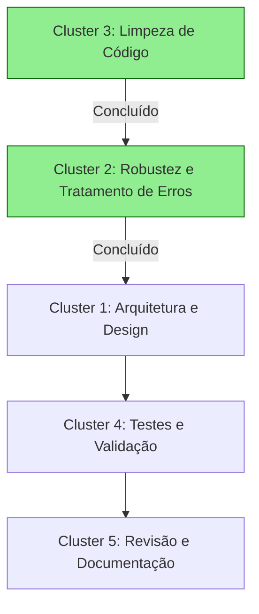
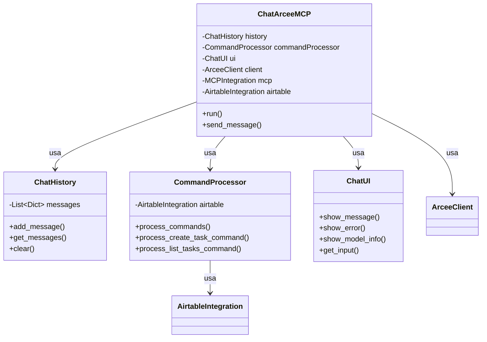

# Mapa de Relações entre Clusters de Refatoração

Este documento visualiza como os diferentes clusters da refatoração se relacionam entre si, suas dependências e a sequência ideal de implementação.

## Visão Geral dos Clusters

1. **Cluster de Arquitetura e Design** (Complexidade: Alta)
   - Extração de classes com responsabilidades únicas
   - Implementação de interfaces para desacoplamento
   - Injeção de dependências para testabilidade

2. **Cluster de Robustez e Tratamento de Erros** (Complexidade: Média) ✅
   - Sistema de exceções personalizadas
   - Tratamento de erros específicos
   - Logging detalhado para depuração

3. **Cluster de Limpeza de Código** (Complexidade: Baixa) ✅
   - Remoção de código não utilizado
   - Melhoria de legibilidade
   - Documentação de APIs

4. **Cluster de Testes e Validação** (Complexidade: Média)
   - Testes unitários
   - Testes de integração
   - Mocks para serviços externos

5. **Cluster de Revisão e Documentação** (Complexidade: Baixa)
   - Documentação de arquitetura
   - Atualização de README
   - Revisão final

## Matriz de Dependências

A matriz abaixo mostra as dependências entre os clusters. "X" indica que o cluster da linha depende do cluster da coluna para sua implementação ideal.

|                                   | Arquitetura | Robustez | Limpeza | Testes | Revisão |
|-----------------------------------|-------------|----------|---------|--------|---------|
| **Cluster de Arquitetura**        |      -      |    X     |    ✓    |        |         |
| **Cluster de Robustez**           |             |     -    |    ✓    |        |         |
| **Cluster de Testes**             |      X      |    X     |    ✓    |    -   |         |
| **Cluster de Revisão**            |      X      |    X     |    ✓    |    X   |    -    |

Legenda:
- X: Dependência forte (o cluster da linha depende do cluster da coluna)
- ✓: Cluster já concluído

## Fluxo de Implementação

## Impacto das Mudanças entre Clusters

1. **Impacto do Cluster de Arquitetura nos outros clusters**:
   - **Robustez**: A arquitetura limpa facilita o tratamento de erros contextualizado por componente
   - **Testes**: Classes com responsabilidade única são mais fáceis de testar isoladamente
   - **Revisão**: Arquitetura clara facilita a documentação e manutenção

2. **Impacto do Cluster de Robustez nos outros clusters**:
   - **Arquitetura**: Exceções bem definidas ajudam a delimitar responsabilidades
   - **Testes**: Facilita a criação de testes para cenários de erro
   - **Revisão**: Melhora a documentação de comportamentos de erro

3. **Impacto do Cluster de Testes nos outros clusters**:
   - **Arquitetura**: Pode revelar problemas de design que exigem refatoração
   - **Robustez**: Ajuda a identificar cenários de erro não tratados
   - **Revisão**: Serve como documentação viva do comportamento esperado

## Classes a serem Implementadas e suas Relações

## Próximos Passos Detalhados

Considerando as dependências e o trabalho já realizado, recomenda-se a seguinte sequência de implementação:

1. **Extração da classe ChatHistory**
   - Implementação isolada e simples
   - Não depende de outras refatorações pendentes
   - Facilita testes unitários futuros

2. **Extração da classe ChatUI**
   - Implementação isolada para interação com usuário
   - Não depende de outras refatorações pendentes
   - Permitirá substituição mais fácil caso necessário

3. **Extração da classe CommandProcessor**
   - Depende parcialmente da implementação do sistema de exceções (já concluído)
   - Requer a refatoração dos métodos de processamento de comandos

4. **Refatoração da classe principal ChatArceeMCP**
   - Depende da implementação das classes acima
   - Utilizará injeção de dependências para usar as novas classes

5. **Implementação de testes unitários**
   - Depende da separação clara de responsabilidades
   - Facilitada pela arquitetura orientada a interfaces

Os Clusters 2 (Robustez) e 3 (Limpeza) já foram concluídos, o que proporciona uma base sólida para a implementação do Cluster 1 (Arquitetura). 