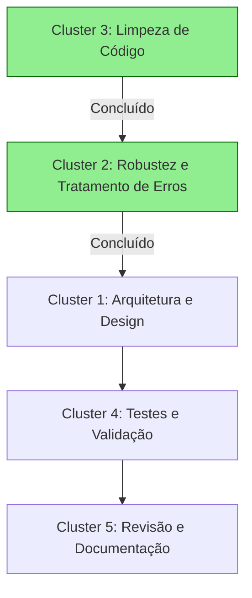
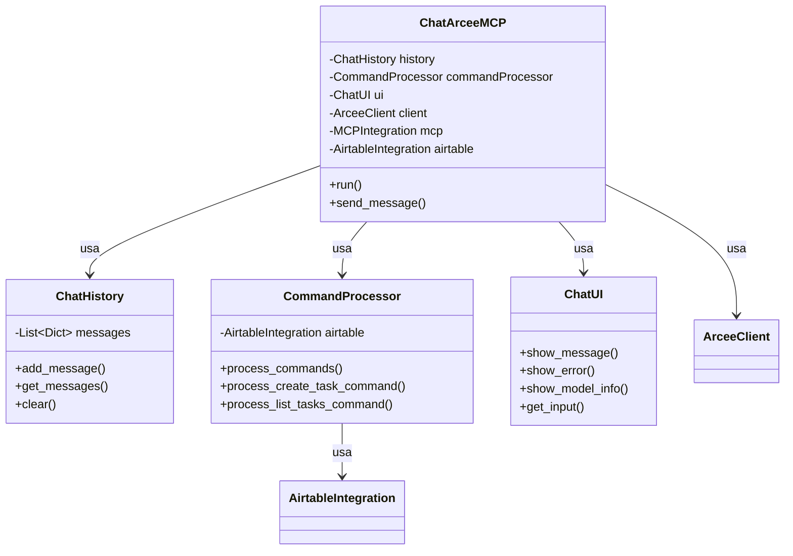

# Mapa de Relações entre Clusters de Refatoração

Este documento visualiza como os diferentes clusters da refatoração se relacionam entre si, suas dependências e a sequência ideal de implementação.

## Visão Geral dos Clusters

1. **Cluster de Arquitetura e Design** (Complexidade: Alta)
   - Extração de classes com responsabilidades únicas
   - Implementação de interfaces para desacoplamento
   - Injeção de dependências para testabilidade

2. **Cluster de Robustez e Tratamento de Erros** (Complexidade: Média) ✅
   - Sistema de exceções personalizadas
   - Tratamento de erros específicos
   - Logging detalhado para depuração

3. **Cluster de Limpeza de Código** (Complexidade: Baixa) ✅
   - Remoção de código não utilizado
   - Melhoria de legibilidade
   - Documentação de APIs

4. **Cluster de Testes e Validação** (Complexidade: Média)
   - Testes unitários
   - Testes de integração
   - Mocks para serviços externos

5. **Cluster de Revisão e Documentação** (Complexidade: Baixa)
   - Documentação de arquitetura
   - Atualização de README
   - Revisão final

## Matriz de Dependências

A matriz abaixo mostra as dependências entre os clusters. "X" indica que o cluster da linha depende do cluster da coluna para sua implementação ideal.

|                                   | Arquitetura | Robustez | Limpeza | Testes | Revisão |
|-----------------------------------|-------------|----------|---------|--------|---------|
| **Cluster de Arquitetura**        |      -      |    X     |    ✓    |        |         |
| **Cluster de Robustez**           |             |     -    |    ✓    |        |         |
| **Cluster de Testes**             |      X      |    X     |    ✓    |    -   |         |
| **Cluster de Revisão**            |      X      |    X     |    ✓    |    X   |    -    |

Legenda:
- X: Dependência forte (o cluster da linha depende do cluster da coluna)
- ✓: Cluster já concluído

## Fluxo de Implementação



## Impacto das Mudanças entre Clusters

1. **Impacto do Cluster de Arquitetura nos outros clusters**:
   - **Robustez**: A arquitetura limpa facilita o tratamento de erros contextualizado por componente
   - **Testes**: Classes com responsabilidade única são mais fáceis de testar isoladamente
   - **Revisão**: Arquitetura clara facilita a documentação e manutenção

2. **Impacto do Cluster de Robustez nos outros clusters**:
   - **Arquitetura**: Exceções bem definidas ajudam a delimitar responsabilidades
   - **Testes**: Facilita a criação de testes para cenários de erro
   - **Revisão**: Melhora a documentação de comportamentos de erro

3. **Impacto do Cluster de Testes nos outros clusters**:
   - **Arquitetura**: Pode revelar problemas de design que exigem refatoração
   - **Robustez**: Ajuda a identificar cenários de erro não tratados
   - **Revisão**: Serve como documentação viva do comportamento esperado

## Classes a serem Implementadas e suas Relações



## Detalhamento dos Clusters

### Cluster 1: Arquitetura e Design

**Objetivo**: Reestruturar o código para melhor separação de responsabilidades e aplicação de padrões de design.

**Riscos**: Introdução de bugs sutis, quebra de funcionalidade existente.

#### Tarefas:

- [ ] **SRP - Passo 1**: Extrair gerenciamento de histórico (ChatHistory)
  ```python
  class ChatHistory:
      """Gerencia o histórico de mensagens do chat"""
      
      def __init__(self, system_instruction=None):
          self.messages = []
          if system_instruction:
              self.add_message("system", system_instruction)
      
      def add_message(self, role, content):
          """Adiciona uma mensagem ao histórico"""
          self.messages.append({"role": role, "content": content})
      
      def get_messages(self):
          """Retorna uma cópia do histórico de mensagens"""
          return self.messages.copy()
      
      def clear(self, preserve_system=True):
          """Limpa o histórico, opcionalmente preservando a mensagem do sistema"""
          system_message = None
          if preserve_system and self.messages and self.messages[0]["role"] == "system":
              system_message = self.messages[0]
          
          self.messages = []
          if system_message:
              self.messages.append(system_message)
  ```

- [ ] **SRP - Passo 2**: Extrair processamento de comandos (CommandProcessor)
  ```python
  class CommandProcessor:
      """Processa comandos especiais no chat"""
      
      def __init__(self, airtable_service):
          self.airtable_service = airtable_service
      
      def process_commands(self, text):
          """Processa todos os comandos especiais no texto"""
          processed_text = text
          processed_text = self.process_create_task_command(processed_text)
          processed_text = self.process_list_tasks_command(processed_text)
          return processed_text
      
      def process_create_task_command(self, text):
          """Processa comandos de criação de tarefas"""
          # Lógica extraída do método original process_special_commands
          # ...
          return processed_text
      
      def process_list_tasks_command(self, text):
          """Processa comandos de listagem de tarefas"""
          # Lógica extraída do método original process_special_commands
          # ...
          return processed_text
      
      def extract_task_parameters(self, match):
          """Extrai e valida parâmetros de uma tarefa a partir de um match de regex"""
          # Lógica para extrair parâmetros
          # ...
          return params
  ```

- [ ] **SRP - Passo 3**: Extrair interface de usuário (ChatUI)
  ```python
  class ChatUI:
      """Gerencia a interface de usuário do chat"""
      
      def __init__(self):
          self.prompt = "\n👤 Você: "
      
      def show_welcome_message(self, servers=None):
          """Exibe mensagem de boas-vindas"""
          print("\n🤖 Chat Interativo com Arcee (modo 'auto') + Integração MCP iniciado!")
          print("   Digite 'sair', 'exit' ou 'quit' para encerrar o chat.")
          print("   Digite 'limpar' ou 'clear' para limpar o histórico.")
          if servers:
              print(f"   Servidores MCP disponíveis: {', '.join(servers)}\n")
      
      def get_user_input(self):
          """Obtém entrada do usuário"""
          return input(self.prompt)
      
      def show_thinking(self):
          """Mostra indicador de processamento"""
          print("\n🔄 Processando...")
      
      def show_response(self, text):
          """Exibe resposta do assistente"""
          print(f"\n🤖 Arcee: {text}")
      
      def show_model_info(self, response_data):
          """Exibe informações sobre o modelo utilizado"""
          # Lógica extraída do método original
          # ...
      
      def show_error(self, error_message):
          """Exibe mensagem de erro"""
          print(f"\n❌ Erro: {error_message}")
      
      def show_goodbye(self):
          """Exibe mensagem de despedida"""
          print("\n👋 Encerrando chat. Até a próxima!")
  ```

- [ ] **SRP - Passo 4**: Refatorar a classe principal (ChatArceeMCP)
  ```python
  class ChatArceeMCP:
      """Implementação de chat interativo com Arcee e MCP"""
      
      def __init__(self, llm_client=None, mcp_integration=None, airtable=None, ui=None):
          # Injeção de dependências
          self.client = llm_client or self._create_default_client()
          self.mcp_integration = mcp_integration or MCPIntegration()
          self.airtable = airtable or AirtableIntegration()
          self.ui = ui or ChatUI()
          self.history = ChatHistory(self._get_system_instruction())
          self.command_processor = CommandProcessor(self.airtable)
          self.available_servers = self.mcp_integration.list_available_servers()
          
      def _create_default_client(self):
          # Lógica para criar cliente padrão
          # ...
          
      def _get_system_instruction(self):
          # Define instrução do sistema
          # ...
          
      def run(self):
          """Executa o loop principal do chat"""
          try:
              self.ui.show_welcome_message(self.available_servers)
              while True:
                  user_input = self.ui.get_user_input()
                  
                  if self._handle_special_input(user_input):
                      continue
                  
                  if not user_input.strip():
                      continue
                  
                  response = self._process_user_message(user_input)
                  if response:
                      self.ui.show_response(response.get('processed_text', response['text']))
                      self.ui.show_model_info(response)
          except KeyboardInterrupt:
              self.ui.show_goodbye()
              
      def _handle_special_input(self, user_input):
          """Trata comandos especiais do usuário"""
          # Lógica para comandos como exit, clear, etc
          # ...
          
      def _process_user_message(self, message):
          """Processa mensagem do usuário e obtém resposta"""
          # Lógica simplificada para enviar mensagem e processar resposta
          # ...
  ```

- [ ] **DIP - Passo 1**: Criar interfaces abstratas
  ```python
  from abc import ABC, abstractmethod

  class LLMClient(ABC):
      """Interface para clientes de modelos de linguagem"""
      
      @abstractmethod
      def generate_content_chat(self, messages):
          """Gera conteúdo a partir de mensagens de chat"""
          pass

  class MCPService(ABC):
      """Interface para serviços MCP"""
      
      @abstractmethod
      def list_available_servers(self):
          """Lista servidores disponíveis"""
          pass

  class TaskService(ABC):
      """Interface para serviço de tarefas"""
      
      @abstractmethod
      def create_task(self, task_name, description, deadline, status):
          """Cria uma nova tarefa"""
          pass
      
      @abstractmethod
      def list_tasks(self):
          """Lista as tarefas existentes"""
          pass
  ```

- [ ] **DIP - Passo 2**: Adaptar implementações existentes
  ```python
  class ArceeClientAdapter(LLMClient):
      """Adaptador para o cliente Arcee"""
      
      def __init__(self, model="auto"):
          self.client = ArceeClient(model=model)
      
      def generate_content_chat(self, messages):
          return self.client.generate_content_chat(messages)

  class MCPIntegrationAdapter(MCPService):
      """Adaptador para a integração MCP"""
      
      def __init__(self):
          self.integration = MCPIntegration()
      
      def list_available_servers(self):
          return self.integration.list_available_servers()

  class AirtableServiceAdapter(TaskService):
      """Adaptador para o serviço Airtable"""
      
      def __init__(self, api_key=None, base_id=None, table_id=None):
          self.service = AirtableIntegration()
          if api_key:
              self.service.api_key = api_key
          if base_id:
              self.service.base_id = base_id
          if table_id:
              self.service.table_id = table_id
      
      def create_task(self, task_name, description=None, deadline=None, status="Not started"):
          return self.service.create_task(task_name, description, deadline, status)
      
      def list_tasks(self):
          return self.service.list_tasks()
  ```

- [ ] **DIP - Passo 3**: Implementar Factory para criação de serviços
  ```python
  class ServiceFactory:
      """Fábrica para criar instâncias de serviços"""
      
      @staticmethod
      def create_llm_client(client_type="arcee", **kwargs):
          """Cria cliente LLM baseado no tipo"""
          if client_type.lower() == "arcee":
              return ArceeClientAdapter(**kwargs)
          # Pode ser expandido para suportar outros tipos de cliente
          raise ValueError(f"Tipo de cliente LLM não suportado: {client_type}")
      
      @staticmethod
      def create_mcp_service():
          """Cria serviço MCP"""
          return MCPIntegrationAdapter()
      
      @staticmethod
      def create_task_service(service_type="airtable", **kwargs):
          """Cria serviço de tarefas baseado no tipo"""
          if service_type.lower() == "airtable":
              return AirtableServiceAdapter(**kwargs)
          # Pode ser expandido para suportar outros tipos de serviços
          raise ValueError(f"Tipo de serviço de tarefas não suportado: {service_type}")
  ```

- [ ] **DIP - Passo 4**: Atualizar script principal para usar Factory
  ```python
  def main():
      """Função principal do script"""
      try:
          # Criar serviços usando Factory
          llm_client = ServiceFactory.create_llm_client(model="auto")
          mcp_service = ServiceFactory.create_mcp_service()
          task_service = ServiceFactory.create_task_service()
          
          # Criar UI
          ui = ChatUI()
          
          # Criar e executar chat
          chat = ChatArceeMCP(llm_client, mcp_service, task_service, ui)
          chat.run()
      
      except Exception as e:
          print(f"❌ Erro ao inicializar: {e}")
          sys.exit(1)
  ```

### Cluster 2: Robustez e Tratamento de Erros

**Objetivo**: Melhorar a resiliência do código e o tratamento de situações excepcionais.

**Riscos**: Falhas na captura de exceções, inconsistências no tratamento de erros.

#### Tarefas:

- [x] **Sistema de Exceções**
  - [x] Criar hierarquia de exceções personalizadas (MpccliException como base)
  - [x] Implementar exceções específicas (LLMApiError, ConfigurationError, etc.)

- [x] **Tratamento de Erros**
  - [x] Refinar try/catch para capturar exceções específicas
  - [x] Implementar feedback mais detalhado ao usuário
  - [x] Adicionar logging para depuração

### Cluster 3: Limpeza de Código

**Objetivo**: Remover código não utilizado e simplificar a base de código.

**Riscos**: Remoção acidental de código necessário.

#### Tarefas:

- [x] **Remoção de Código Não Utilizado**
  - [x] Remover o método get_server_tools()
  - [x] Avaliar e documentar ou remover start_server()
  - [x] Identificar e remover outros métodos, importações ou parâmetros não utilizados

- [x] **Melhoria de Legibilidade**
  - [x] Dividir método process_special_commands() em funções menores
  - [x] Atualizar documentação de classes e métodos
  - [x] Adicionar comentários em áreas complexas

### Cluster 4: Testes e Validação

**Objetivo**: Garantir a qualidade e estabilidade do código refatorado.

**Riscos**: Cobertura de testes insuficiente.

#### Tarefas:

- [ ] **Testes Unitários**
  - [ ] Desenvolver testes para ChatHistory
  - [ ] Desenvolver testes para CommandProcessor
  - [ ] Desenvolver testes para ChatUI
  ```python
  # Exemplo de estrutura para testes unitários
  import unittest
  from unittest.mock import MagicMock, patch
  
  class TestChatHistory(unittest.TestCase):
      def test_add_message(self):
          # ...
      
      def test_clear_with_preserve(self):
          # ...
  
  class TestCommandProcessor(unittest.TestCase):
      def test_process_create_task(self):
          # ...
      
      def test_process_list_tasks(self):
          # ...
  ```

- [ ] **Testes de Integração**
  - [ ] Desenvolver testes que verificam a interação entre componentes
  - [ ] Testar fluxos principais (envio de mensagens, processamento de comandos)
  
- [ ] **Mocks para Serviços Externos**
  - [ ] Desenvolver mocks para ArceeClient
  - [ ] Desenvolver mocks para Airtable API

### Cluster 5: Revisão e Documentação

**Objetivo**: Finalizar a documentação e revisar a aderência às regras de desenvolvimento.

**Riscos**: Documentação incompleta ou inconsistente.

#### Tarefas:

- [ ] **Documentação**
  - [ ] Atualizar README.md
  - [ ] Criar guia de contribuição
  - [ ] Documentar arquitetura geral

- [ ] **Revisão**
  - [ ] Verificar aderência às regras do `.cursorrules`
  - [ ] Validar desempenho após mudanças
  - [ ] Incorporar feedback de usuários

## Plano de Implementação (5 Fases)

1. **Fase 1: Refatoração Estrutural**
   - [ ] Criar novas classes (ChatHistory, CommandProcessor, ChatUI)
   - [ ] Refatorar ChatArceeMCP para usar essas classes
   - [ ] Implementar interfaces e adapters
   - [ ] Implementar ServiceFactory

2. **Fase 2: Melhorias de Robustez** ✅
   - [x] Implementar exceções personalizadas
   - [x] Refinar tratamento de erros
   - [x] Adicionar logging detalhado

3. **Fase 3: Limpeza e Documentação** ✅
   - [x] Remover código não utilizado
   - [x] Atualizar documentação
   - [x] Adicionar comentários explicativos em áreas complexas

4. **Fase 4: Testes e Validação**
   - [ ] Desenvolver testes unitários
   - [ ] Desenvolver testes de integração
   - [ ] Validar funcionalidades em ambiente real

5. **Fase 5: Revisão Final**
   - [ ] Revisar aderência às regras do `.cursorrules`
   - [ ] Validar performance
   - [ ] Incorporar feedback de usuários

## Próximos Passos Detalhados

Considerando as dependências e o trabalho já realizado, recomenda-se a seguinte sequência de implementação:

1. **Extração da classe ChatHistory**
   - Implementação isolada e simples
   - Não depende de outras refatorações pendentes
   - Facilita testes unitários futuros

2. **Extração da classe ChatUI**
   - Implementação isolada para interação com usuário
   - Não depende de outras refatorações pendentes
   - Permitirá substituição mais fácil caso necessário

3. **Extração da classe CommandProcessor**
   - Depende parcialmente da implementação do sistema de exceções (já concluído)
   - Requer a refatoração dos métodos de processamento de comandos

4. **Refatoração da classe principal ChatArceeMCP**
   - Depende da implementação das classes acima
   - Utilizará injeção de dependências para usar as novas classes

5. **Implementação de testes unitários**
   - Depende da separação clara de responsabilidades
   - Facilitada pela arquitetura orientada a interfaces

Os Clusters 2 (Robustez) e 3 (Limpeza) já foram concluídos, o que proporciona uma base sólida para a implementação do Cluster 1 (Arquitetura). 


## Mapa de Relações entre Clusters

```
┌───────────────────────┐     ┌───────────────────────┐
│                       │     │                       │
│  1. Reestruturação    │────▶│  2. Tratamento de     │
│     Arquitetural      │     │     Erros e Robustez  │
│                       │     │                       │
└───────────┬───────────┘     └───────────┬───────────┘
            │                             │
            ▼                             ▼
┌───────────────────────┐     ┌───────────────────────┐
│                       │     │  4. ver se o cli na   │
│  3. Limpeza de        │     │ parte de mcp estamos  │
│     Código            │────▶│ conseguindo buscar    │
│                       │     │os mesmos mcp do cursor│
└───────────┬───────────┘     └───────────┬───────────┘
            │                             │
            └──────────────┬──────────────┘
                          │
                          ▼
             ┌───────────────────────┐
             │                       │
             │  5. Planejamento e    │
             │     Gestão            │
             │                       │
             └───────────────────────┘
```